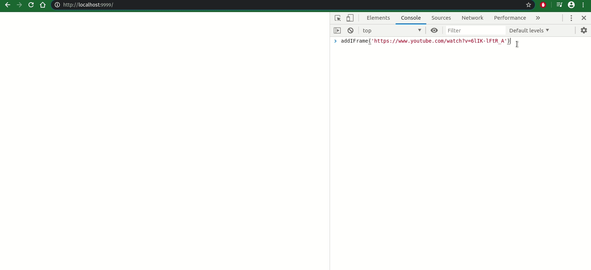

# console-mixer

No-nonsense utility converting youtube/soundcloud/bandcamp links to iframes via
the browser console.

[_As used during Disconomics' quarantine series_](https://www.mixcloud.com/disconomics/).



## How to run this thing

- Go to https://disconomics.xyz/console-mixer/
- open console (e.g with `<ctrl-alt-j>`)
- use `addIFrame` and/or `pasteIFrame` to add content
- start mixing !

## How to run this thing locally

- `git clone` this repo, `cd` into it
- boot up server e.g.

```
$ npm i -g http-server
$ http-server -p 9999

# OR
$ python3 -m http.server 9999
```

- open up http://localhost:9999/
- open console (e.g with `<ctrl-alt-j>`)
- use `addIFrame` and/or `pasteIFrame` to add content
- start mixing !

## License

[MIT](./LICENSE)
